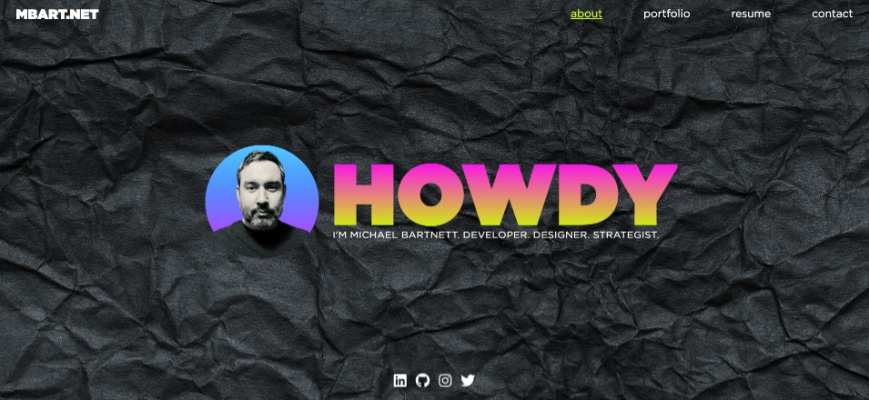

# React-Personal-Portfolio

## Description
A React-built portfolio of my full stack web development projects.

## Table of Contents

&bull; [Installation & Testing](#installation--testing) 
&bull; [Usage](#usage) 
&bull; [License](#license) 
&bull; [How to Contribute](#how-to-contribute) 
&bull; [Questions](#questions)

## Installation and Testing

To get started with the project, clone the repository, navigate into the root directory of the project, install the dependencies using `npm install`, start the development server using `npm run dev`, and build the project for production using `npm run build`. 

## Usage

[mbart.net](https://mbart.net)

## License

Copyright © 2022, Michael Bartnett, edX Boot Camps LLC. Distributed under the [MIT](https://opensource.org/licenses/MIT) License. 

## How to Contribute

If you have a suggestion that would make this application better, please fork the repo and create a pull request.

## Questions

Contact: mbartnett@gmail.com, [github.com/mbartnett](https://github.com/mbartnett)    
